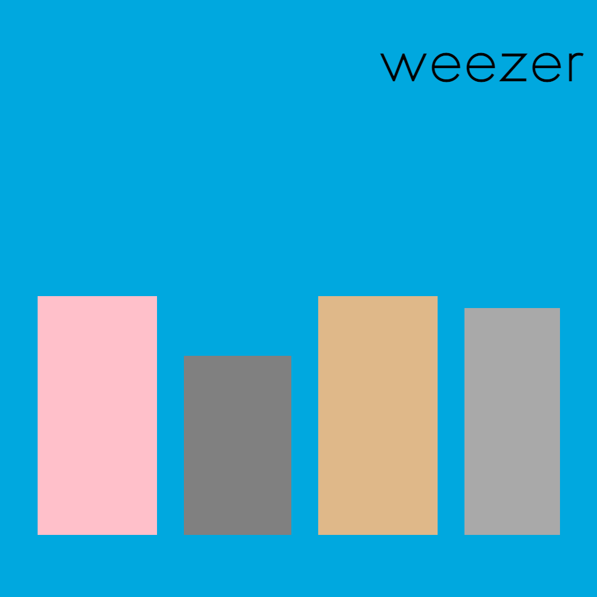

# The Blue Album

Made a cubist rendering of the Weezer blue album using CSS rules.  Used width and height and background color to make a square representing the album cover.
Used display flex, flex direction, and justify content to align objects. Added 4 rectangles using varying width and height and colors. Changed the order of list item elements using nth-child pseudo class.

## link 
https://choyoonme.github.io/blue-album/

## mock up
